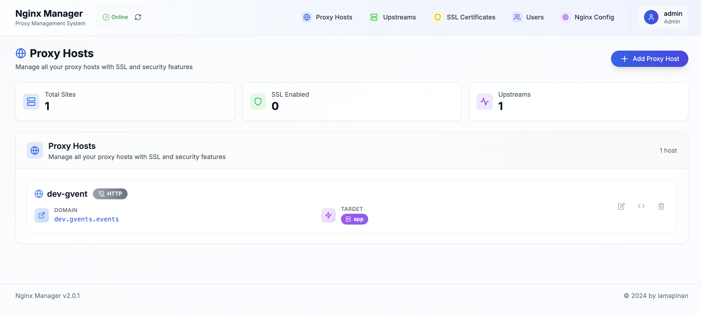

# Nginx Manager v2.0.2

A modern, web-based Nginx reverse proxy manager, designed to simplify the management of proxy hosts, SSL certificates, and upstream servers through an intuitive interface.



## Features

### **Core Functionality**
- **Proxy Host Management**: Create, edit, and delete proxy hosts with custom configurations
- **SSL Certificate Management**: Automatic SSL certificate generation and renewal with Let's Encrypt integration
- **Upstream Management**: Configure and manage upstream servers for load balancing
- **Real-time Configuration**: Live Nginx configuration editing with validation
- **Status Monitoring**: Real-time Nginx service status monitoring

### **Security & Authentication**
- User authentication system with role-based access control
- Secure session management
- Protected API routes
- Admin and user role permissions

### **Modern Interface**
- Clean, responsive design built with Tailwind CSS
- Real-time updates and status indicators
- Intuitive dashboard with statistics
- Dark/light theme support
- Mobile-friendly interface

### **Advanced Features**
- Automatic Nginx configuration generation
- Configuration validation before applying changes
- Backup and restore functionality
- Docker integration ready
- Supervisor process management
- Cron job automation for certificate renewal

## Technology Stack

- **Frontend**: Next.js, React, TypeScript, Tailwind CSS
- **Backend**: Node.js, Express, SQLite
- **Authentication**: Custom JWT-based authentication
- **Server**: Nginx, Supervisor, Certbot
- **Containerization**: Docker, Docker Compose

## Quick Start

### Prerequisites

- Docker and Docker Compose
- Node.js
- Git

### Installation with Docker (Recommended)

1. **Clone the repository**
   ```bash
   git clone <repository-url>
   cd greeting-card-proxy
   ```

2. **Start with Docker Compose**
   ```bash
   docker-compose up -d
   ```

3. **Access the application**
   - Open your browser and navigate to `http://localhost:3000`
   - Use default credentials:
     - **Username**: `admin`
     - **Password**: `admin123`

### Development Setup

1. **Clone and install dependencies**
   ```bash
   git clone <repository-url>
   cd greeting-card-proxy
   npm install
   ```

2. **Start development server**
   ```bash
   npm run dev
   ```

3. **Access the application**
   - Development server: `http://localhost:3000`

## Configuration

### Environment Variables

Create a `.env.local` file in the root directory:

```env
# Database
DATABASE_PATH=./data/database.db

# Application
NODE_ENV=production
NEXT_PUBLIC_APP_URL=http://localhost:3000

# Nginx
NGINX_CONFIG_PATH=./nginx-config
NGINX_CONF_PATH=./nginx.conf

# SSL
SSL_EMAIL=your-email@domain.com
```

### Default User

The application comes with a default admin user:
- **Username**: `admin`
- **Password**: `admin123`

⚠️ **Important**: Change the default password after first login for security.

## Usage

### Adding a Proxy Host

1. Click "Add Proxy Host" button on the dashboard
2. Fill in the required information:
   - **Domain**: Your domain name (e.g., `example.com`)
   - **Forward Hostname/IP**: Target server IP or hostname
   - **Forward Port**: Target server port
3. Configure SSL settings if needed
4. Save the configuration

### SSL Certificate Management

1. Navigate to "Certificates" section
2. Click "Request New Certificate"
3. Enter domain names
4. The system will automatically request and install SSL certificates
5. Certificates are automatically renewed before expiration

### Managing Upstreams

1. Go to "Upstreams" section
2. Create upstream groups for load balancing
3. Add multiple servers to each upstream
4. Configure load balancing method (round-robin, least-connected, etc.)

### User Management

1. Access "Users" section (Admin only)
2. Create new users with appropriate roles
3. Manage user permissions and access levels

## API Documentation

### Authentication Endpoints

- `POST /api/auth/login` - User login
- `POST /api/auth/logout` - User logout
- `GET /api/auth/me` - Get current user info

### Sites Management

- `GET /api/sites` - List all proxy hosts
- `POST /api/sites` - Create new proxy host
- `PUT /api/sites/[id]` - Update proxy host
- `DELETE /api/sites/[id]` - Delete proxy host

### SSL Certificates

- `GET /api/certificates` - List certificates
- `POST /api/certificates` - Request new certificate
- `POST /api/certificates/renew-all` - Renew all certificates

### System Management

- `GET /api/nginx/status` - Nginx service status
- `POST /api/nginx/validate` - Validate configuration
- `GET /api/config` - Get system configuration

## Docker Configuration

The application includes a complete Docker setup:

### Services

- **nginx-manager**: Main Next.js application
- **nginx**: Nginx reverse proxy server
- **supervisor**: Process management

### Volumes

- `./data:/app/data` - Database and persistent data
- `./nginx-config:/etc/nginx/sites-enabled` - Nginx site configurations
- `./ssl:/etc/ssl/certs` - SSL certificates storage

### Ports

- `80`: HTTP traffic
- `443`: HTTPS traffic  
- `3000`: Application interface

## File Structure

```
greeting-card-proxy/
├── app/                    # Next.js app directory
│   ├── api/               # API routes
│   ├── auth/              # Authentication pages
│   ├── certificates/      # SSL management
│   ├── config/            # System configuration
│   ├── upstreams/         # Upstream management
│   └── users/             # User management
├── components/            # React components
├── lib/                   # Utility libraries
├── data/                  # Database files
├── nginx-config/          # Nginx configurations
├── docker-compose.yml     # Docker composition
├── Dockerfile            # Docker build file
└── supervisord.conf      # Supervisor configuration
```

## Contributing

1. Fork the repository
2. Create a feature branch (`git checkout -b feature/amazing-feature`)
3. Commit your changes (`git commit -m 'Add amazing feature'`)
4. Push to the branch (`git push origin feature/amazing-feature`)
5. Open a Pull Request

### Logs

View application logs:
```bash
# All services
docker-compose logs

# Specific service
docker-compose logs nginx-manager
docker-compose logs nginx
```

## Security Considerations

- Change default admin credentials immediately
- Use strong passwords for all user accounts
- Regularly update SSL certificates
- Monitor access logs for suspicious activity
- Keep the application updated to the latest version
- Use HTTPS in production environments

## Performance Optimization

- Enable Nginx caching for static content
- Configure appropriate upstream health checks
- Monitor system resources and scale as needed
- Use CDN for static assets when possible
- Implement rate limiting for API endpoints

## License

This project is licensed under the GNU General Public License v3.0 - see the [LICENSE](LICENSE) file for details.

## Support

- 📧 Email: iamapinan@gmail.com
- 🌐 Website: [https://iamapinan.com](https://iamapinan.com)

## Acknowledgments

- Built with ❤️ by [iamapinan](https://github.com/iamapinan)
- SSL certificates provided by Let's Encrypt
- Icons by Lucide React

---

**Version**: 2.0.2 
**Last Updated**: 06/2025  
**Maintainer**: [iamapinan](https://github.com/iamapinan)

